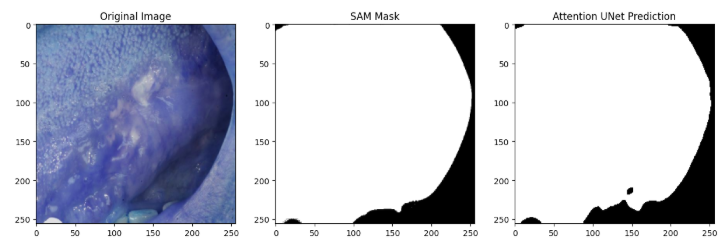
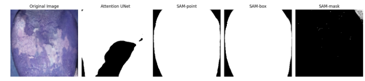
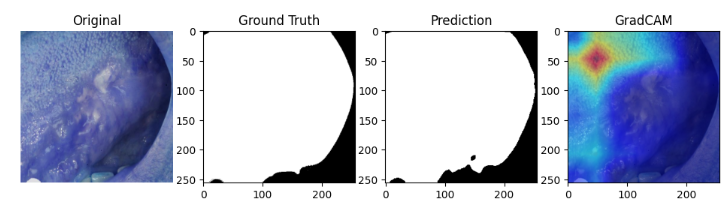
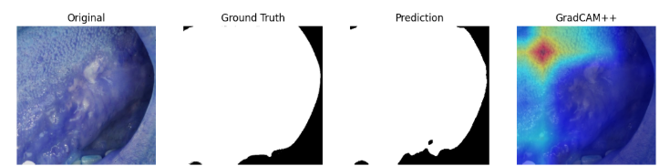

# Oral Cancer Lesion Segmentation using Deep Learning, SAM and Explainable AI

## Project Overview
This project focuses on automated segmentation of oral cancer lesions from medical images using deep learning models integrated with the Segment Anything Model (SAM) and Explainable AI techniques.

The goal of this work is to improve lesion segmentation accuracy and provide interpretable results that can assist clinicians in early diagnosis.

---

## Motivation
Oral cancer is a major health concern worldwide. Early detection plays an important role in improving survival rates. Manual analysis of medical images can be time-consuming and subjective.

This project explores how deep learning and foundation models can improve lesion segmentation and support clinical decision making.

---

## Workflow

1. Dataset Collection
2. Image Preprocessing
3. Training Deep Learning Segmentation Models
4. Integration of Segment Anything Model (SAM)
5. Prompt Sensitivity Analysis (PSA)
6. Segmentation Refinement
7. Model Evaluation
8. Explainable AI Visualization

---

## Dataset
The dataset consists of oral cancer lesion images with corresponding ground truth masks.

Each image contains:
- Input oral lesion image
- Ground truth segmentation mask

These masks are used for training and evaluation of the segmentation models.

---

## Preprocessing
The following preprocessing steps were applied:

- Image resizing
- Pixel normalization
- Dataset splitting (training and validation)

These steps ensure consistent input for deep learning models.

---

## Models Used

The following segmentation models were evaluated:

- U-Net
- U-Net++
- Attention U-Net
- Swin U-Net

These models were trained and compared based on segmentation performance.

---

## SAM Integration

The Segment Anything Model (SAM) was integrated to improve lesion mask generation.

SAM generates segmentation masks using prompts such as:

- Bounding Box Prompt
- Point Prompt
- Mask Prompt

These prompts guide the model to focus on lesion regions.

---

## Prompt Sensitivity Analysis (PSA)

Different prompt types were evaluated to analyze their effect on segmentation accuracy.

Tested prompts:
- Box Prompt
- Point Prompt
- Mask Prompt

Experimental observations showed that **box prompts produced the most accurate segmentation results**, while **point prompts worked well with Attention U-Net refinement**.

---

## Evaluation Metrics

The segmentation models were evaluated using:

- Dice Score
- Intersection over Union (IoU)
- Precision
- Recall

These metrics measure the similarity between predicted masks and ground truth masks.

---

## Explainable AI

To interpret model predictions, Explainable AI techniques were applied:

- Grad-CAM
- Grad-CAM++

These methods generate heatmaps showing which regions of the image influenced the model's prediction.

This improves transparency and trust in AI-based medical systems.

---

## Results

The integration of SAM with deep learning models significantly improved segmentation accuracy.

Among all models tested, **Attention U-Net combined with SAM produced the best Dice and IoU scores**.
## Results

### SAM Mask

### PSA 

### GradCAM Visualization

### GradCAM++ Visualization

---

---

## How to Run the Project (Google Colab)
git clone https://github.com/yourusername/oral-cancer-segmentation.git
1. Clone the repository

2. Open the notebooks in Google Colab

3. Upload the dataset

4. Run the notebooks step by step:

- preprocessing.ipynb
- model training notebooks
- SAM integration notebook
- XAI visualization notebook

---

## Future Work

Future improvements may include:

- Deployment of the model on Edge AI devices
- Optimization of models for real-time inference
- Training with larger clinical datasets
- Fine-tuning SAM for medical image segmentation
- Integration with clinical diagnostic systems

---

## Technologies Used

- Python
- PyTorch
- OpenCV
- Google Colab
- Segment Anything Model (SAM)

---

## Conclusion

This project demonstrates that integrating foundation models such as SAM with deep learning segmentation networks can significantly improve oral cancer lesion detection. Additionally, Explainable AI techniques provide interpretability, making the system more reliable for clinical applications.

---

## Author

Laxmipriya Rout

